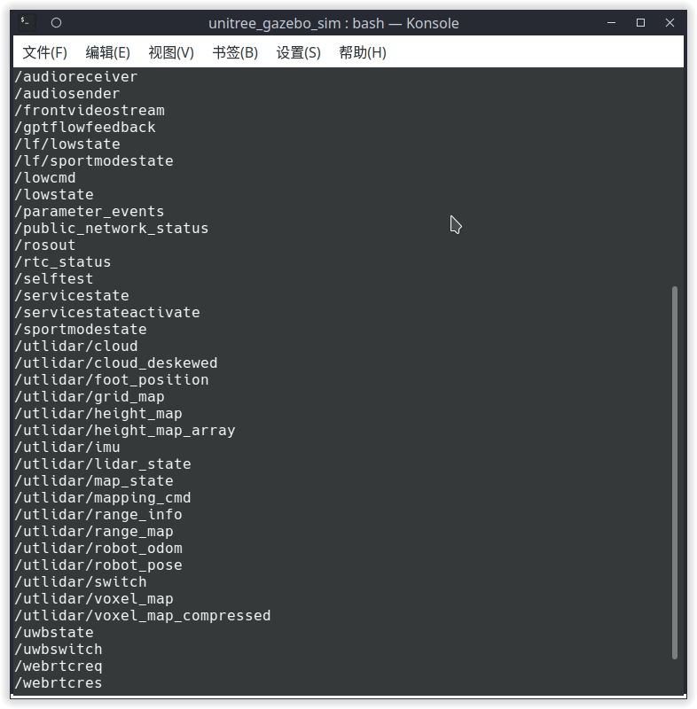
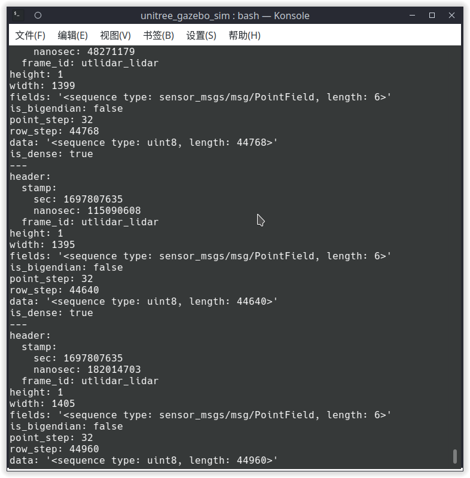
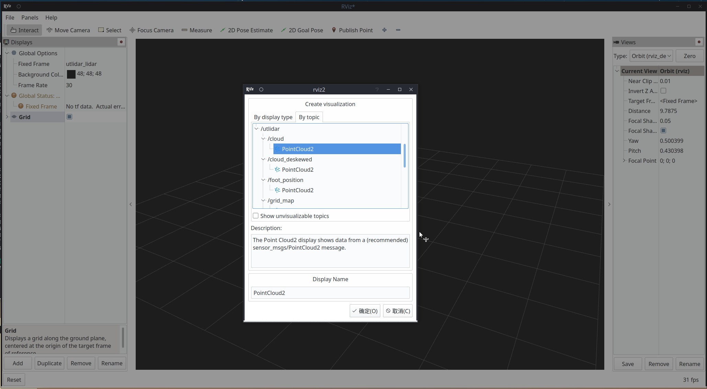
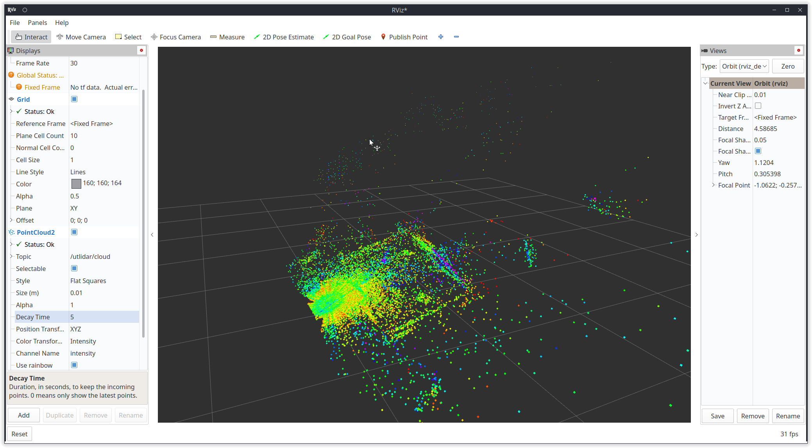

Unitree robot ROS2 support

[TOC]

# Introduction
Unitree SDK2 implements an easy-to-use robot communication mechanism based on Cyclonedds, which enable developers to achieve robot communication and control (**Supports Unitree Go2, B2, and H1**). See: https://github.com/unitreerobotics/unitree_sdk2

DDS is alos used in ROS2 as a communication mechanism. Therefore, the underlying layers of Unitree Go2, B2, and H1 robots can be compatible with ROS2. ROS2 msg can be direct used for communication and control of Unitree robot without wrapping the SDK interface.

# Configuration
## System requirements
Tested systems and ROS2 distro
|systems|ROS2 distro|
|--|--|
|Ubuntu 20.04|foxy|
|Ubuntu 22.04|humble (recommend)|

If you want to directly use the `Docker development environment`, you can refer to the `Dockerfile` related content in the `.devcontainer` folder.
You can also use the `Dev Container feature of VSCode` or other IDEs to create a development environment, or use `Github's codespace` to quickly create a development environment.
If you do encounter compilation issues, you can refer to the compilation scripts in `. github/workflows/` or ask questions in `issues`.

##Install Unitree Robot Ros2 Feature Pack

Taking ROS2 foxy as an example, if you need another version of ROS2, replace "foxy" with the current ROS2 version name in the corresponding place:

The installation of ROS2 foxy can refer to: https://docs.ros.org/en/foxy/Installation/Ubuntu-Install-Debians.html

ctrl+alt+T open the terminal, clone the repository: https://github.com/unitreerobotics/unitree_ros2

```bash
git clone https://github.com/unitreerobotics/unitree_ros2
```
where:
- **cyclonedds_ws**: The workspace of Unitree ros2 package. The msg for Unitree robot are supplied in the subfolder cyclonedds_ws/unitree/unitree_go and cyclonedds_ ws/unitree/unitree_api.
- **example**: The workspace of some examples.


## Install Unitree ROS2 package

### 1. Dependencies
```bash
sudo apt install ros-foxy-rmw-cyclonedds-cpp
sudo apt install ros-foxy-rosidl-generator-dds-idl
sudo apt install libyaml-cpp-dev
```

### 2. Compile cyclone dds (If using Humble, this step can be skipped)
The cyclonedds version of Unitree robot is 0.10.2. To communicate with Unitree robots using ROS2, it is necessary to change the dds implementation. See：https://docs.ros.org/en/foxy/Concepts/About-Different-Middleware-Vendors.html

Before compiling cyclonedds, please ensure that ros2 environment has **NOT** been sourced when starting the terminal. Otherwise, it may cause errors in compilation.

If "source/opt/ros/foxy/setup. bash" has been added to the ~/.bashrc file when installing ROS2, it needs to be commented out:

```bash
sudo apt install gedit
sudo gedit ~/.bashrc
``` 
```bash
# source /opt/ros/foxy/setup.bash 
```


Compile cyclone-dds
```bash
cd ~/unitree_ros2/cyclonedds_ws/src
git clone https://github.com/ros2/rmw_cyclonedds -b foxy
git clone https://github.com/eclipse-cyclonedds/cyclonedds -b releases/0.10.x 
cd ..
# If build failed, try run: `export LD_LIBRARY_PATH=/opt/ros/foxy/lib` first.
colcon build --packages-select cyclonedds #Compile cyclone-dds package
```

### 3. Compile unitree_go and unitree_api packages
After compiling cyclone-dds, ROS2 dependencies is required for compilation of the unitree_go and unitree_api packages. Therefore, before compiling, it is necessary to source the environment of ROS2.
```bash
source /opt/ros/foxy/setup.bash # source ROS2 environment
colcon build # Compile all packages in the workspace
```

## Connect to Unitree robot

### 1. Network configuration
Connect Unitree robot and the computer using Ethernet cable. Then, use ifconfig to view the network interface that the robot connected. For example, "enp3s0" in the following figure.


Next, open the network settings, find the network interface that the robot connected.In IPv4 setting, change the IPv4 mode to manual, set the address to 192.168.123.99, and set the mask to 255.255.255.0. After completion, click apply and wait for the network to reconnect.


Open setup.sh file.
```bash
sudo gedit ~/unitree_ros2/setup.sh
```
```bash
#!/bin/bash
echo "Setup unitree ros2 environment"
source /opt/ros/foxy/setup.bash
source $HOME/unitree_ros2/cyclonedds_ws/install/setup.bash
export RMW_IMPLEMENTATION=rmw_cyclonedds_cpp
export CYCLONEDDS_URI='<CycloneDDS><Domain><General><Interfaces>
                            <NetworkInterface name="enp3s0" priority="default" multicast="default" />
                        </Interfaces></General></Domain></CycloneDDS>'
```
where "enp3s0" is the network interface name of unitree robot connected.
Modify it to the corresponding network interface according to the actual situation. 

Source the environment to setup the ROS2 support of Unitree robot: 
```bash
source ~/unitree_ros2/setup.sh
```
If you don't want to source the bash script every time when a new terminal opens, you can write the content of bash script into ~/.bashrc, but attention should be paid when there are multiple ROS environments coexisting in the system.

If your computer is not connected to the robot but you still want to use Unitree ROS2 for simulation and other functions, you can use the local loopback "lo" as the network interface.
```bash
source ~/unitree_ros2/setup_local.sh # use "lo" as the network interface
```
or
```bash
source ~/unitree_ros2/setup_default.sh # No network network interface specified 
```


### 2. Connect and test
After completing the above configuration, it is recommended to restart the computer before conducting the test.

Ensure that the network of robot is connected correctly, open a terminal and input:  
```bash
source ~/unitree_ros2/setup.sh
ros2 topic list
```
You can see the following topics:


Input ros2 topic echo /sportmodestate，you can see the data of the topic as shown in the following figure：


### 3. Examples

The source code of examples locates at `/example/src/src`.
- common: Common functions for all robots.
- g1/lowlevel/g1_low_level_example: Low level control for G1
- h1-2/lowlevel/low_level_ctrl_hg: Low level control for H1-2
- low_level_ctrl: Low level control for Go2/B2
- read_low_state: Read the low state from Go2/B2
- read_low_state_hg: Read the low state from G1/H1/H1-2
- read_motion_state: Read the sport mode state from Go2/B2
- read_ wireless_controller: Read the state of wireless controller from G1/Go2/B2
- record_bag: Ros bag recording example.
- go2/go2_sport_client: High level control for Go2.
- go2/go2_stand_example: Stand example for Go2.
- go2/go2_robot_state_client：Robot State Example for Go2。

Open a terminal and input:
```bash
source ~/unitree_ros2/setup.sh
cd ~/unitree_ros2/example
colcon build
```
After compilation, run in the terminal:
```bash
./install/unitree_ros2_example/bin/read_motion_state 
```
You can see the robot status information output from the terminal:

```bash
[INFO] [1697525196.266174885] [motion_state_suber]: Position -- x: 0.567083; y: 0.213920; z: 0.052338; body height: 0.320000
[INFO] [1697525196.266230044] [motion_state_suber]: Velocity -- vx: -0.008966; vy: -0.001431; vz: -0.019455; yaw: -0.002131
[INFO] [1697525196.266282725] [motion_state_suber]: Foot position and velcity relative to body -- num: 0; x: 0.204149; y: -0.145194; z: -0.067804, vx: 0.002683; vy: 0.003745; vz: -0.010052
[INFO] [1697525196.266339057] [motion_state_suber]: Foot position and velcity relative to body -- num: 1; x: 0.204200; y: 0.145049; z: -0.068205, vx: -0.001954; vy: -0.003442; vz: -0.004828
[INFO] [1697525196.266392028] [motion_state_suber]: Foot position and velcity relative to body -- num: 2; x: -0.183385; y: -0.159294; z: -0.039468, vx: -0.000739; vy: -0.002028; vz: -0.004532
[INFO] [1697525196.266442766] [motion_state_suber]: Foot position and velcity relative to body -- num: 3; x: -0.182412; y: 0.159754; z: -0.039045, vx: -0.002803; vy: -0.001381; vz: -0.004794
[INFO] [1697525196.316189064] [motion_state_suber]: Gait state -- gait type: 1; raise height: 0.090000
```

# Usage
## State acquisition
### 1. Sportmode state
Sportmode state includes position, velcity, foot position, and other motion states of the robot. The acquisition of sportmode state can be achieved by subscribing "lf/sportmodestate" or "sportmodestate" topic, where "lf" represents low frequency. The msg of sportmodestate is defined as：

```C++
TimeSpec stamp // Time stamp
uint32 error_code //Error code
IMUState imu_state //IMU state
uint8 mode //Sport mode
/*
Sport mode
0. idle, default stand
1. balanceStand
2. pose
3. locomotion
4. reserve
5. lieDown
6. jointLock
7. damping
8. recoveryStand
9. reserve
10. sit
11. frontFlip
12. frontJump
13. frontPounc
*/
float32 progress //Is the dance action being executed?：0. dance false; 1. dance true
uint8 gait_type //Gait type
/*
Gait type
0.idle  
1.trot  
2.run  
3.climb stair  
4.forwardDownStair   
9.adjust
*/
float32 foot_raise_height 
float32[3] position 
float32 body_height
float32[3] velocity 
float32 yaw_speed
float32[4] range_obstacle
int16[4] foot_force 
float32[12] foot_position_body //foot positions in body frame
float32[12] foot_speed_body //foot velcities in body frame
```
For details, see：https://support.unitree.com/home/en/developer/sports_services.

Complete examples is in /example/src/read_motion_state.cpp. Run in the terminal:
```bash
./install/unitree_ros2_example/bin/read_motion_state 
```

### 2. Low-level state
The low-level state includes motors states, power information, and other low level states.  Low-level states can be obtained by subscribing "lf/lowstate" or "lowstate" topic. The lowstate msg is defined as:

```C++
uint8[2] head
uint8 level_flag
uint8 frame_reserve
uint32[2] sn
uint32[2] version
uint16 bandwidth
IMUState imu_state //IMU
MotorState[20] motor_state //Motor state
BmsState bms_state
int16[4] foot_force 
int16[4] foot_force_est
uint32 tick
uint8[40] wireless_remote
uint8 bit_flag
float32 adc_reel
int8 temperature_ntc1
int8 temperature_ntc2
float32 power_v 
float32 power_a 
uint16[4] fan_frequency 
uint32 reserve
uint32 crc
```
where MotorState are defined as：
```C++
uint8 mode        // Mode, 0x01 for control
float32 q         // Joint angle
float32 dq        // Joint velocity
float32 ddq       // Joint acceleration
float32 tau_est   // Estimated torque
float32 q_raw     //raw data of q
float32 dq_raw    //raw data of dq
float32 ddq_raw   //raw data of dq
int8 temperature 
uint32 lost
uint32[2] reserve
```
For details, see: https://support.unitree.com/home/en/developer/Basic_services
Complete examples is in example/src/read_low_state.cpp. 

### 3. Wireless controller

Wireless controller state can be obtained by subscribing "/wirelesscontroller" topic. The  wirelesscontroller msg is defiened as:

```C++
float32 lx // left joystick x, range [-1.0~1.0]
float32 ly // left joystick y, range [-1.0~1.0]
float32 rx // right joystick x, range [-1.0~1.0]
float32 ry // right joystick y, range [-1.0~1.0]
uint16 keys // key values
```
For details, see: https://support.unitree.com/home/en/developer/Get_remote_control_status

Complete examples is in example/src/read_wireless_controller.cpp.


## Robot control
### 1. Sportmode 
Sportmode control is implemented by request/response mechanism. Sportmode control  can be achieved by sending unitree_api::msg::Request msg to the "/api/sport/request" topic.

The Request msg for different sportmode interfaces can be obtained by the SportClient (/example/src/common/ros2_sport_client.cpp) class. For example, control the robot to reach a desired attitude: 
```C++
 //Create a ros2 pubilsher 
rclcpp::Publisher<unitree_api::msg::Request>::SharedPtr req_puber = this->create_publisher<unitree_api::msg::Request>("/api/sport/request", 10);

SportClient sport_req; //Sportclient
unitree_api::msg::Request req; //Sportmode request msg
sport_req.Euler(req,roll,pitch,yaw); //Get Sportmode request msg from Sportclient 

req_puber->publish(req); // Publish request msg
```
For details about SportClient：https://support.unitree.com/home/en/developer/sports_services

Complete examples is in：example/src/sport_mode_ctrl.cpp. Run ./install/unitree_ros2_example/bin/sport_mode_ctrl in terminal. After 1 second of program startup, the robot will walk back and forth in the x direction.


### 2. Motor control
The torque, position and velocity control of motor can be implemented by subscribing "/lowcmd" topic and sending unitree_go::msg::LowCmd msg. LowCmd msg is defined as:
```C++
uint8[2] head
uint8 level_flag
uint8 frame_reserve
uint32[2] sn
uint32[2] version
uint16 bandwidth
MotorCmd[20] motor_cmd //motor command
BmsCmd bms_cmd
uint8[40] wireless_remote
uint8[12] led
uint8[2] fan
uint8 gpio
uint32 reserve
uint32 crc
```
where motor_cmd is defined as:
```C++
uint8 mode;  //Mode（Foc mode -> 0x01 ，stop mode -> 0x00)
float q;     //Target position (rad)
float dq;    //Target velocity (rad/s)
float tau;   //Target torque (N.M)
float kp;    
float kd;    
unsigned long reserve[3]; 
```
For details about low_cmd：https://support.unitree.com/home/en/developer/Basic_services

Complete examples is in：example/src/low_level_ctrl.cpo. Run ./install/unitree_ros2_example/bin/sport_mode_ctrl in terminal. The hip motor and calf motor of the RL leg will rotate to the corresponding joint angle.

## Rviz
We can also use rviz to visualize Unitree robot data.The following is an example of visualizing robot lidar data:

Firstly, list all topics：
```bash
ros2 topic list
```


We can find the topic of lida：
```bash
utlidar/cloud
```
Then, echo frame_id of lidar：
```
ros2 topic echo --no-arr /utlidar/cloud
```
where frame_id: utlidar_lidar


Finally, run rviz：
```
ros2 run rviz2 rviz2
```
Add Pointcloud topic: utlidar/cloud in rviz2 and modify Fixed frame to utlidar_lidar. Then, the lidar data is displayed in rviz2. 






